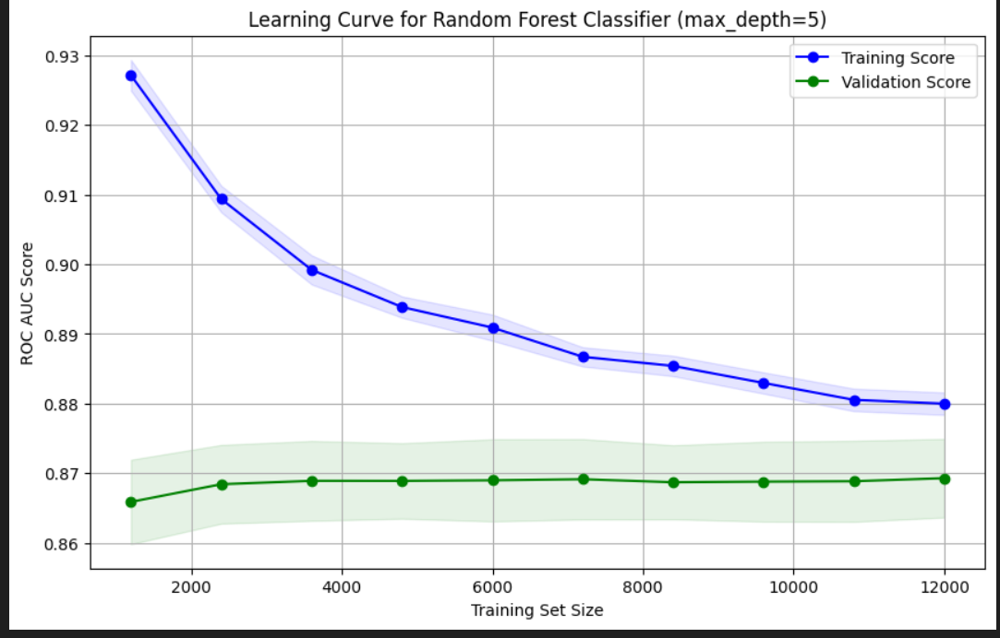

# Welcome 

This repository contains a machine learning pipeline for training and optimizing classification models, specifically designed for predicting smoking behavior. The pipeline includes data preparation, model optimization, training, validation, and submission generation.

### ROC-AUC


## Project Structure

```
├── data_preparation.py   # Data loading and preprocessing
├── libraries.py         # Core ML pipeline components
├── main.ipynb          # Main execution notebook
├── README.md           # This file
├── plot               # ROC-AUC grafic
├── train.csv           # Training data (required)
└── test.csv            # Test data (required)
```

## Features

- Automated data preparation and train-validation split
- Model optimization using Optuna
- Support for Random Forest and Logistic Regression classifiers
- Model calibration using CalibratedClassifierCV
- Learning curve visualization
- Submission file generation for competitions

## Prerequisites

Required Python packages:
```bash
pandas
numpy
scikit-learn
optuna
matplotlib
```

Install the required packages using:
```bash
pip install pandas numpy scikit-learn optuna matplotlib
```

## Usage

1. Prepare your data:
   - Place your training data in `train.csv`
   - Place your test data in `test.csv`
   - Ensure your training data has 'smoking' as the target column and 'id' as the identifier
   - Ensure your test data has 'id' as the identifier

2. Run the pipeline:
   - Open and run `main.ipynb` in Jupyter Notebook/Lab
   - Or import and use the classes directly in your Python script

```python
from data_preparation import DataPreparation
from libraries import ModelOptimization, ModelTraining, SubmissionPreparation

# Initialize data preparation
data_prep = DataPreparation(train_path='train.csv', test_path='test.csv')
X_train, X_val, y_train, y_val, X_test_final, test_ids = data_prep.prepare_data()

# Optimize model
model_opt = ModelOptimization(X_train, y_train)
best_params = model_opt.optimize()

# Train and validate model
model_train = ModelTraining(best_params, X_train, y_train, X_val, y_val)
trained_model = model_train.train_model()
model_train.validate_model()
model_train.plot_learning_curve()

# Generate submission
submission_prep = SubmissionPreparation(trained_model, X_test_final, test_ids)
submission_prep.create_submission()
```

## Components

### DataPreparation
- Loads train and test data
- Splits features and target
- Creates train-validation split

### ModelOptimization
- Performs hyperparameter optimization using Optuna
- Supports both Random Forest and Logistic Regression
- Uses cross-validation for robust evaluation

### ModelTraining
- Trains the model with optimized parameters
- Includes model calibration
- Provides validation metrics
- Generates learning curves

### SubmissionPreparation
- Creates prediction submissions
- Saves results in CSV format

## Model Parameters

### Random Forest Parameters
- max_depth: 2-32
- n_estimators: 50-200
- max_features: sqrt, log2, or None
- min_samples_split: 2-10
- min_samples_leaf: 1-4

### Logistic Regression Parameters
- C: 1e-10 to 1e10
- penalty: l1, l2, or elasticnet
- solver: liblinear or saga
- l1_ratio: 0.0-1.0 (for elasticnet)

## Output

- Validation ROC-AUC score
- Learning curve plot
- submission.csv file with predictions

